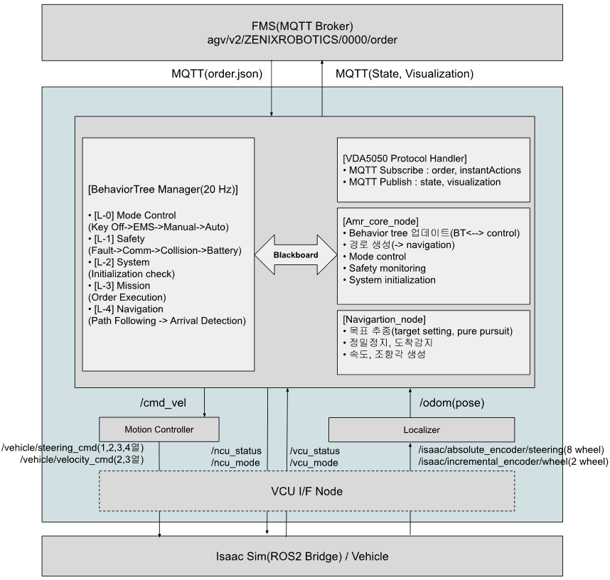

# 소개
 이 저장소는 AMR(Autonomous Mobile Robot)의 네비게이션 SW를 포함하고 있습니다.  
 pagv_amr_core, pagv_localizer, pagv_motion_controller 총 3개의 패키지로 구성되어 있습니다. 
 pagv_amr_core는 네비게이션 동작/판단, FMS통신, Planning, Safety를 담당하며, Behavior tree/ amr_core_node/ vda5050_protocol/ navigation 으로 구성되어 있습니다. 
 pagv_motion_controller는 planning 출력(/cmd_vel)을 입력 받아, 차량모델에 맞는 제어출력(/steering_cmd, /velocity_cmd) 생성을 담당합니다. 
 pagv_localizer는 map에서 차량의 위치와 자세 추정을 담당합니다.
 
 - 주요기능
   - VDA5050 Protocol: 표준 FMS 통신 프로토콜 지원
   - BehaviorTree 기반 상태 관리: 5-Layer 계층 구조 (Mode/Safety/System/Mission/Navigation)
   - 8륜 4축 All-Wheel Steering: ICR 제어 알고리즘
   - 경로 추종: 직선 및 곡선(Arc) 경로 지원
   - Dead Reckoning Localization: 엔코더 기반 위치 추정 (향후 SLAM 확장 예정)
   - Isaac Sim 연동: ROS2 Bridge를 통한 시뮬레이션
 
 
 
```
pagv_amr_nav
├── pagv_amr_core
│   ├── behavior_trees
│   │   └── pagv_behavior_tree.xml
│   ├── CMakeLists.txt
│   ├── include
│   │   └── pagv_amr_core
│   │       ├── amr_core_node.hpp
│   │       ├── blackboard
│   │       │   └── blackboard_keys.hpp
│   │       ├── bt_nodes
│   │       │   ├── mission_layer
│   │       │   │   └── mission_layer_node.hpp
│   │       │   ├── mode_layer
│   │       │   │   └── mode_layer_node.hpp
│   │       │   ├── navigation_layer
│   │       │   │   └── navigation_layer_node.hpp
│   │       │   ├── safety_layer
│   │       │   │   └── safety_layer_node.hpp
│   │       │   └── system_layer
│   │       │       └── system_layer_node.hpp
│   │       ├── navigation
│   │       │   ├── arrival_detector.hpp
│   │       │   ├── navigation_manager.hpp
│   │       │   └── path_follower.hpp
│   │       └── order_execution
│   │           └── order_execution_manager.hpp
│   ├── package.xml
│   └── src
│       ├── amr_core_node.cpp
│       ├── bt_nodes
│       │   ├── mission_layer
│       │   │   └── mission_layer_node.cpp
│       │   ├── mode_layer
│       │   │   └── mode_layer_node.cpp
│       │   ├── navigation_layer
│       │   │   └── navigation_layer_node.cpp
│       │   ├── safety_layer
│       │   │   └── safety_layer_node.cpp
│       │   └── system_layer
│       │       └── system_layer_node.cpp
│       ├── navigation
│       │   ├── arrival_detector.cpp
│       │   ├── navigation_manager.cpp
│       │   └── path_follower.cpp
│       └── order_execution
│           └── order_execution_manager.cpp
├── pagv_bringup
│   ├── CMakeLists.txt
│   ├── launch
│   │   └── pagv_full_system.launch.py
│   └── package.xml
├── pagv_localizer
│   ├── CMakeLists.txt
│   ├── include
│   │   └── pagv_localizer
│   │       └── localizer_node.hpp
│   ├── package.xml
│   └── src
│       └── localizer_node.cpp
├── pagv_motion_controller
│   ├── CMakeLists.txt
│   ├── include
│   │   └── pagv_motion_controller
│   │       └── motion_controller_node.hpp
│   ├── package.xml
│   └── src
│       └── motion_controller_node.cpp
└── vda5050_handler
    ├── CMakeLists.txt
    ├── include
    │   └── vda5050_handler
    │       └── vda5050_protocol.h
    ├── package.xml
    └── src
        └── vda5050_protocol.cpp
```


# Usage
- Dependency
```
# ROS2 Humble
sudo apt install ros-humble-desktop

# 의존성 패키지
sudo apt install ros-humble-behaviortree-cpp
sudo apt install ros-humble-tf2-ros
sudo apt install ros-humble-geometry-msgs
sudo apt install ros-humble-nav-msgs

# MQTT (Paho MQTT C++)
sudo apt install libpaho-mqttpp-dev

# JSON 라이브러리
sudo apt install nlohmann-json3-dev
```

- Build
```
cd ~/ros2_ws
colcon build --packages-select pagv_amr_core pagv_motion_controller pagv_localizer pagv_bringup
source install/setup.bash
```

- Run
```
ros2 launch pagv_bringup pagv_nav_system.launch.py
```

- MQTT Broker
```
# Mosquitto 설치 
sudo apt install mosquitto mosquitto-clients 
# Broker 실행 
mosquitto -v 
# Order 전송 테스트 
mosquitto_pub -h localhost -t "agv/v2/ZENIXROBOTICS/0000/order" -f curve.json
```


# Todo
1. 프로젝트 폴더 및 파일 구조 설계[done]
2. VDA5050_Protocol[done]
3. pagv_amr_core[done]
4. navigation_manager[done]
5. motion_controller[done]
6. localizer[done]
7. system_layer[done]
8. mode_layer
9. safety_layer
10. sequence_check
  - S01_PAGV_Boot_with_Auto
  - S02_PAGV_Boot_with_manual 
  - S03_PAGV_Auto_to_Manual
  - S04_PAGV_Manual_to_Auto
  - S05_PAGV_Load
  - S06_PAGV_Unload
  - S07_PAGV_EMS/FAULT
  - S08_PAGV_CHARGING
  - S09_PAGV_KEYOFF

# Toubleshoot

