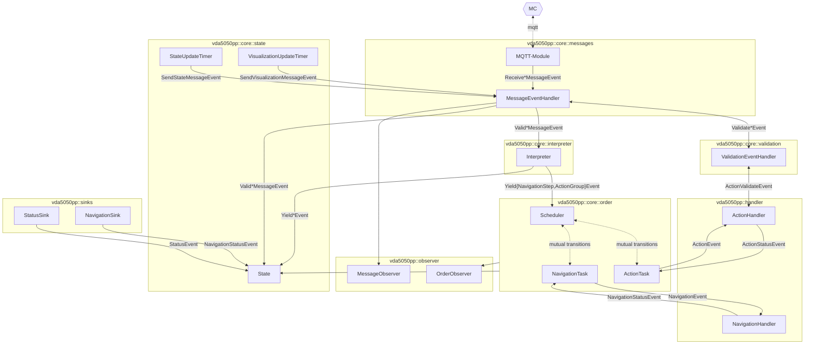

# Architecture

The `libVDA5050++` is best described to follow an event based,
[reactive](https://en.wikipedia.org/wiki/Reactive_programming) architecture.

There are 5 separated concerns, the library is handling:

- `vda5050pp::core::messages` ([docs](messages.md)) is responsible to receive and process MQTT-Messages
- `vda5050pp::core::validation` ([docs](validation.md)) is tightly related to `messages`, it [synchronously](events.md#synchronized-events-obtaining-event-results) validates messages
- `vda5050pp::core::interpreter` ([docs](interpreter.md)) interprets valid messages (orders and instant actions) and yields atomic tasks in order they have to be pursued by the AGV
- `vda5050pp::core::order` ([docs](order.md)) essentially consists of a [scheduler](order.md#scheduler), which triggers AGV Tasks matching the tasks yield by the interpreter.
- `vda5050pp::core::state` ([docs](state.md)) handles the state, as specified in VDA5050. It receives all necessary events to maintain the state and dispatch regular state updates for the message module.

Some parts are accessed by the user implementation:

- `vda5050pp::handler` are the handlers registered by the user. The handler's callbacks are triggered by the scheduler. The response member functions of the handlers advance the scheduler's state.
  Their implementation is described [here](agv_handler.md)
- `vda5050pp::sinks` are common sinks for the user do dump auxiliary information like the battery state into the state
- `vda5050pp::observer` are observers, which receive internal events of the library, like the order state or received messages

The flow of information/events is illustrated in the following diagram:

